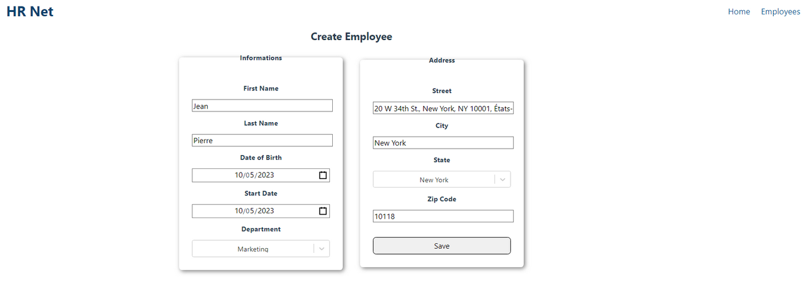

## Faites passer une librairie jQuery vers React - HRnet
### P14 - OpenClassrooms "Développeur Concepteur Logiciel"

#### Contexte du projet

Vous travaillez pour le département technologique d'une grande société financière, WealthHealth.

Cette société utilise une application web interne, appelée HRnet, qui gère les dossiers des employés. L'application est ancienne et utilise jQuery côté front end, ce qui entraîne des bugs considérables et une augmentation des plaintes en interne. Votre équipe de développement s'efforce depuis un certain temps déjà de mettre à niveau l'application.

Un matin, vous vous rendez au travail et remarquez les messages suivants de Jade, une collègue développeuse de l'équipe :

<details><summary><b>Email: Détails sur le projet de refonte </b></summary>

```
De: Jade
À: Moi
```

Salut à toi !

J’ai hâte que tu puisses démarrer ce projet ! Voici un récapitulatif des principales tâches :

- Convertir l'ensemble du projet HRNet en React.
- Convertir l'un des quatre plugins jQuery actuels en React. Remplacer les 3 plugins jQuery restants par des composants React que tu coderas toi-même, ou que tu peux importer depuis des libraires existantes si tu manques de temps.
- Effectuer des tests de performance Lighthouse en comparant l'ancienne et la nouvelle application.

Tu trouveras toutes les informations clés pour chaque tâche ci-dessous :

**Conversion du projet HRNet**

Voici le [repo actuel du projet](https://github.com/Alex-Pqn/HRnet-jQuery-app-ocr_dcl), n'oublie pas que toute l'application HRNet doit être convertie en React :

- Tu devras faire une nouvelle version des pages "Create Employee" et "Employee List" avec React.
- Tu devras ajouter un système de gestion d'état (la version actuelle utilise un stockage local).
- Tu dois aussi t'assurer que tout est cohérent au niveau du style. Pour cela, tu n'es pas obligé de refaire le design de l'application, mais si tu veux changer le style pour quelque chose de plus moderne, tu es le bienvenu.
- Si tu as le temps, tu peux tester le code React avec une suite de tests unitaires. Sinon, seuls des tests manuels sont nécessaires.

**Conversion d'un plugin**

Voici la liste des plugins jQuery actuellement utilisés, choisi-en un parmi ces 4 que tu devras convertir :

- Plugin de sélection de date
- Plugin de fenêtre modale - jQuery.modal.js
- Menus déroulants
- Plugin pour les tables de données

De plus, lors de la conversion d'un plugin jQuery en un composant React, il faut garder à l'esprit de ne convertir que le code qui traite de la fonctionnalité réelle de l'interface utilisateur du plugin. Par exemple, si un plugin jQuery inclut du code AJAX, tu n’as pas besoin de le convertir. Si tu convertis un plugin jQuery pour une fenêtre modale, concentre-toi sur la création d'un composant React qui fonctionne comme une fenêtre modale, et rien d'autre.

**Tests de performance**

Nous voulons également mesurer des données quantifiables (ex. : temps de chargement des pages, appels réseau) pour nous assurer que la conversion de l'application à React améliore effectivement les performances. Pour cela, fais bien des audits de performance Lighthouse. Pour comparer, tu devras en faire un pour l'application jQuery HRnet actuelle, puis un autre une fois que l'application et le plugin jQuery seront convertis en React.

Penses bien à faire un build de l'application avant de faire ton audit. Ça impactera grandement les performances de ton application.

C'est tout ! Une fois que l'application HRnet en React fonctionne, tu peux publier le composant React sur npm sous forme de package et partager le lien pour que nous puissions l'utiliser si nécessaire. Si tu as du mal avec npm, tu peux utiliser les paquets GitHub comme alternative.

Aussi, fais-moi savoir quand tout est fait et nous ferons une révision du code pour répondre aux commentaires restants.

J'ai hâte de voir ce que tu vas faire !

Jade

</details>

Ça y est, vous avez toutes les informations dont vous avez besoin. Maintenant, le plus dur sera de choisir quel plugin jQuery convertir !

#### Objectifs réalisés

- Conversion de la [fenêtre modale en une librairie react](https://github.com/Alex-Pqn/HRNet-modal-ocr_dcl)
- Intégration de la nouvelle librairie sur ce projet
- Site web créé sous React 18.2 et React Router 6.5
- [Rapport de performance](./src/assets/Rapport%20de%20performance.pdf) réalisé
- Redux utilisé pour gérer le state de l'ensemble de l'application
- Utilisation de composants réutilisables et validation des données grâce aux props React
- Architecture des dossiers et fichiers respectée
- Utilisation de Sass et de la méthodologie BEM
- Responsive
  
### [Prévisualisation du site](https://alex-pqn.github.io/HRNet-ocr_dcl/)

## Prerequisites

- You will need to have Node and `npm` installed locally on your machine.

| Node Version | Supported          |
| ------------ | ------------------ |
| 18.x         | :white_check_mark: |

## Project setup

> [!NOTE]
> A [Github Pages preview](https://alex-pqn.github.io/HRNet-ocr_dcl/) is also available for this project

### Install

```
npm install
```

### Compiles and hot-reloads for development

Runs the app in the development mode.\
Open [http://localhost:3000](http://localhost:3000) to view it in your browser.

The page will reload when you make changes.\
You may also see any lint errors in the console.

```
npm start
```

### Running tests

Launches the test runner in the interactive watch mode.\
See the section about [running tests](https://facebook.github.io/create-react-app/docs/running-tests) for more information.

```
npm run test
```

### Compiles and minifies for production

Builds the app for production to the `build` folder.\
It correctly bundles React in production mode and optimizes the build for the best performance.

The build is minified and the filenames include the hashes.\
Your app is ready to be deployed!

See the section about [deployment](https://facebook.github.io/create-react-app/docs/deployment) for more information.

```
npm run build
```

### Eject

**Note: this is a one-way operation. Once you `eject`, you can't go back!**

If you aren't satisfied with the build tool and configuration choices, you can `eject` at any time. This command will remove the single build dependency from your project.

Instead, it will copy all the configuration files and the transitive dependencies (webpack, Babel, ESLint, etc) right into your project so you have full control over them. All of the commands except `eject` will still work, but they will point to the copied scripts so you can tweak them. At this point you're on your own.

You don't have to ever use `eject`. The curated feature set is suitable for small and middle deployments, and you shouldn't feel obligated to use this feature. However we understand that this tool wouldn't be useful if you couldn't customize it when you are ready for it.

```
npm run eject
```

## Preview



<br/>
<br/>
<br/>

